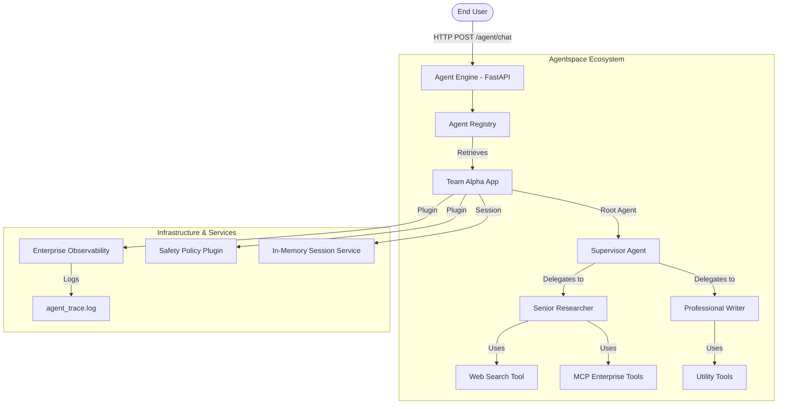

# System Architecture - Google AI Agent System

The Google AI Agent System is built as a highly modular, enterprise-ready platform leveraging the **Google Agent Development Kit (ADK)** for orchestration and **FastAPI** for its service interface.

## 🏗 High-Level Design

The system follows a hierarchical **Supervisor Pattern**, where a root "Brain" (the Supervisor) manages a collection of specialized worker agents.

## 🧠 Core Components

### 1. The Runner & App
The system uses the `google.adk.runners.Runner` to execute agentic flows. An `App` instance wraps the root agent and manages application-wide plugins, context caching, and resumability configurations.

### 2. Hierarchical Delegation
ADK's `LlmAgent` supports native sub-agent delegation. The Supervisor is provided with the child agents as "tools" (automatically handled by ADK), allowing it to transfer control back and forth seamlessly.

### 3. Agentspace Registry
Located in `engine/space/registry.py`, the registry handles:
- **Discovery**: Enumerating available agents and their capabilities.
- **Lazy Initialization**: Agents are only built when requested.
- **Health Management**: Tracks the diagnostic status of every registered entity.

### 4. Memory & Session Management
- **ADK Session Service**: Handles the low-level event history (messages, tool calls, results).
- **Custom MemoryStore**: A high-level store in `engine/memory/store.py` that mirrors session state for easy data visualization and dashboarding.

## 🔄 Execution Flow

1. **Request**: The user sends a message via the `/agent/chat` endpoint.
2. **Bootstrap**: The Engine fetches the requested team from the Registry.
3. **Trace**: The `EnterpriseObservabilityPlugin` initiates a trace for the new invocation.
4. **Reasoning**: The Supervisor analyzes the intent. If research is needed, it calls the `Senior_Researcher`.
5. **Tool Use**: The Researcher may invoke `web_search` or an `mcp_read_document` tool.
6. **Handover**: Once internal tasks are done, control returns to the Supervisor.
7. **Response**: The final synthesized answer is returned to the user and synced to the local `MemoryStore`.
